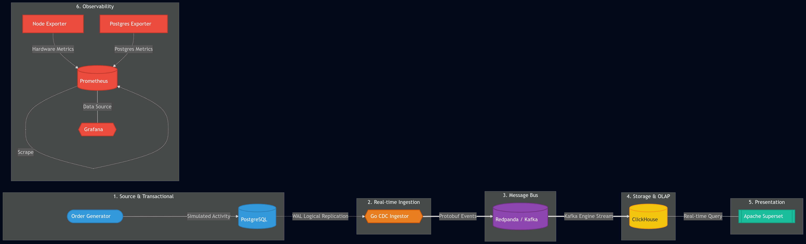
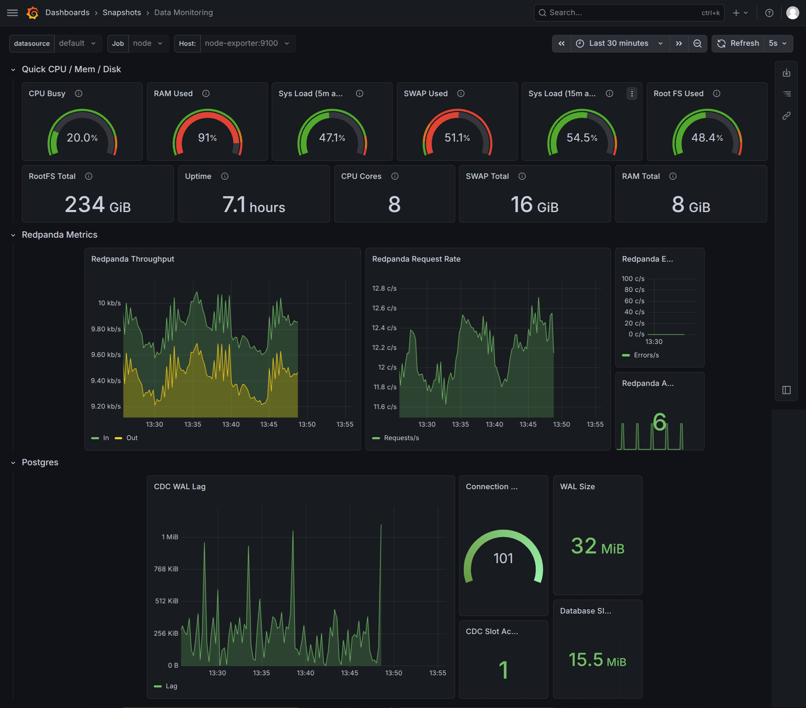
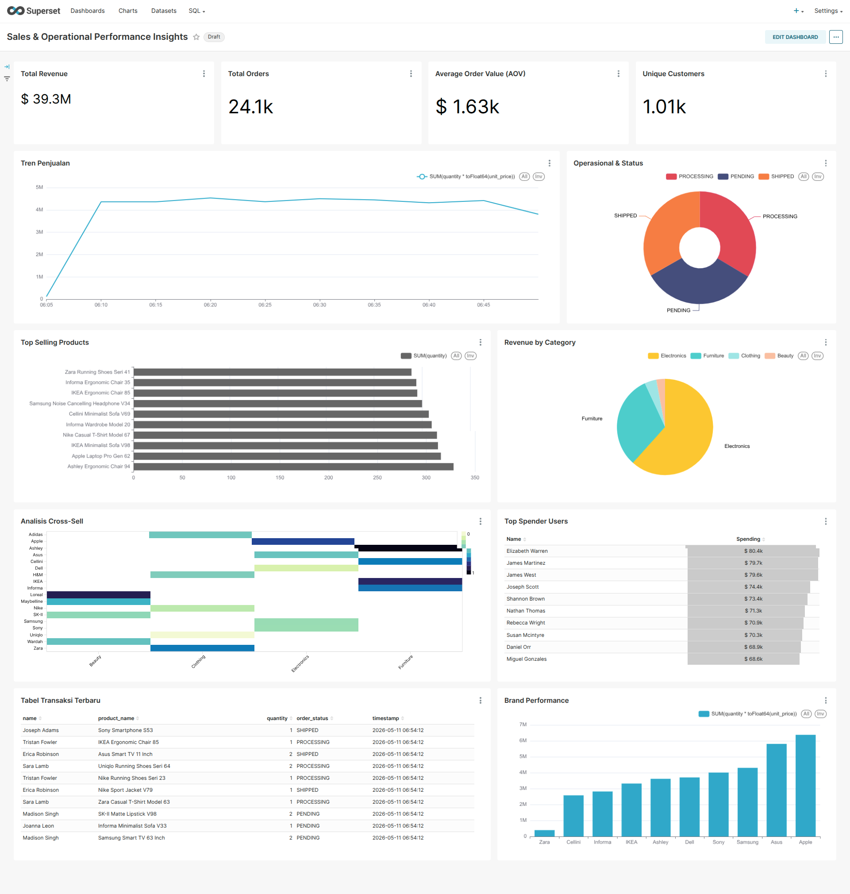

# 🚀 Real-time CDC Pipeline (Postgres → ClickHouse)

Proyek ini adalah implementasi **real-time Change Data Capture (CDC)** dari simulasi database transaksional **E-Commerce** (PostgreSQL) ke ClickHouse. Setiap perubahan data (INSERT/UPDATE/DELETE) pada tabel `users`, `products`, `orders`, dan `order_items` langsung tertangkap, dikirim via Redpanda (Kafka), dan disimpan di ClickHouse sebagai **CDC Event Log** (history tracking) dengan medallion architecture (Bronze → Silver → Gold).

<br>
    


<br>

## 🏗️ Arsitektur

| Layer | Teknologi | Fungsi |
|-------|-----------|--------|
| **Source** | PostgreSQL (WAL) | Simulasi database transaksional E-Commerce (users, products, orders, order_items) |
| **Ingestion** | CDC Ingestor (Go) | Baca WAL → serialize Protobuf → kirim ke Redpanda |
| **Message Broker** | Redpanda (Kafka) | Buffer pesan dengan 3 partisi |
| **Warehouse** | ClickHouse | OLAP dengan CDC Event Logs + Materialized Views + Dictionaries |
| **BI** | Apache Superset | Dashboard analitik dari Gold layer (OBT) |
| **Monitoring** | Prometheus + Grafana | Monitoring WAL Lag, resource, dll |

## 🛠️ Tech Stack

| Teknologi | Kegunaan |
|-----------|----------|
| **Go** | CDC Ingestor — baca WAL PostgreSQL & kirim ke Redpanda |
| **Protobuf** | Serialisasi event CDC (schema evolution, binary format) |
| **PostgreSQL** | Source database transaksional E-Commerce (WAL logical replication) |
| **Redpanda** | Kafka-compatible message broker (3 partisi, row-level ordering) |
| **ClickHouse** | Data warehouse OLAP (Kafka Engine, Materialized Views, Dictionaries) |
| **Apache Superset** | BI dashboard dari Gold layer (One Big Table) |
| **Prometheus + Grafana** | Monitoring pipeline (WAL Lag, resource metrics) |
| **FastAPI (Python)** | Order service & traffic generator (Faker) |
| **Docker Compose** | Orchestrasi 11+ container |

## 📖 Dokumentasi

| Dokumen | Isi |
|---------|-----|
| [System Architecture](docs/system_architecture.md) | Diagram komponen & alur data |
| [Data Architecture](docs/data_architecture.md) | Medallion (Bronze → Silver → Gold) |
| [Data Dictionary](docs/data_dictionary_gold.md) | Skema & metrik tabel Gold (OBT) |
| [ERD Source](docs/erd_source.md) | Entity Relationship Diagram PostgreSQL |
| [ERD Warehouse](docs/erd_warehouse.md) | Entity Relationship Diagram ClickHouse (Bronze/Silver/Gold) |

---

## 🛠️ Cara Jalankan

**Prerequisites:** Docker & Docker Compose

```bash
# 1. Start semua service
make docker-up

# 2. Inisialisasi komponen (urutan penting)
make init-redpanda          # Buat topic cdc-events (3 partisi)
make init-db                # Buat tabel E-Commerce di PostgreSQL (users, products, orders, order_items)
make init-clickhouse        # Bronze Layer (CDC event log tables)
make init-analytics         # Silver & Gold Layer (views + dictionaries + OBT)
make init-superset          # Init admin & import dashboard

# 3. Seed data & testing
make seed-db                # Seed data dummy E-Commerce (users & products)
make generate-traffic       # Bot transaksi E-Commerce otomatis (real-time testing)

# 4. Monitoring
make logs-cdc               # Lihat log CDC ingestor
```

## 📊 Akses Service

| Service | URL | Keterangan |
|---------|-----|------------|
| **Order API** | http://localhost:8000/docs | FastAPI Swagger |
| **Redpanda Console** | http://localhost:8888 | Lihat stream pesan Protobuf |
| **Superset** | http://localhost:8088 | Dashboard BI (admin/admin) |
| **Grafana** | http://localhost:3000 | Monitoring pipeline — WAL Lag, CPU, memory, disk (admin/admin) |
| **Prometheus** | http://localhost:9090 | Metrics pipeline |

### 📈 Grafana — Monitoring Dashboard

Monitoring pipeline secara real-time mencakup:
- **WAL Lag** — delay antara PostgreSQL dan CDC Ingestor
- **Resource Usage** — CPU, memory, disk dari Node Exporter
- **Postgres Metrics** — koneksi, replikasi, long running transactions


<!-- TODO: screenshot dashboard Grafana yang menampilkan WAL Lag dan metrics -->

### 📊 Superset — BI Dashboard

Dashboard analitik E-Commerce dari Gold layer (One Big Table), siap untuk eksplorasi data real-time.


<!-- TODO: screenshot dashboard Superset dengan grafik penjualan -->

## 🧪 Validasi Real-time

Pipeline ini sudah divalidasi dengan cara:
1. **Matikan CDC Ingestor** → WAL Lag naik (numpuk) → traffic tetap jalan
2. **Hidupkan lagi** → WAL Lag turun ke ~0KB (catch up)
3. Data di ClickHouse selalu sinkron dengan PostgreSQL dalam hitungan detik

## 📂 Struktur Proyek

```
├── services/
│   ├── cdc-ingestor/          # CDC Ingestor (Go + pglogrepl + Protobuf)
│   └── order-service/         # FastAPI + Data Generator (Faker)
├── scripts/sql/               # DDL PostgreSQL & ClickHouse
├── deployments/docker/        # Docker Compose + konfigurasi
├── k8s/                       # Kubernetes manifests (WIP)
├── docs/screenshots/          # Screenshot untuk README
├── Makefile                   # Command utama
└── .env                       # Konfigurasi environment
```


*Dibuat untuk keperluan belajar Data Engineering — Real-time Pipeline Journey.*
