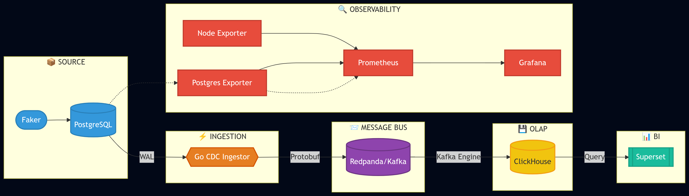
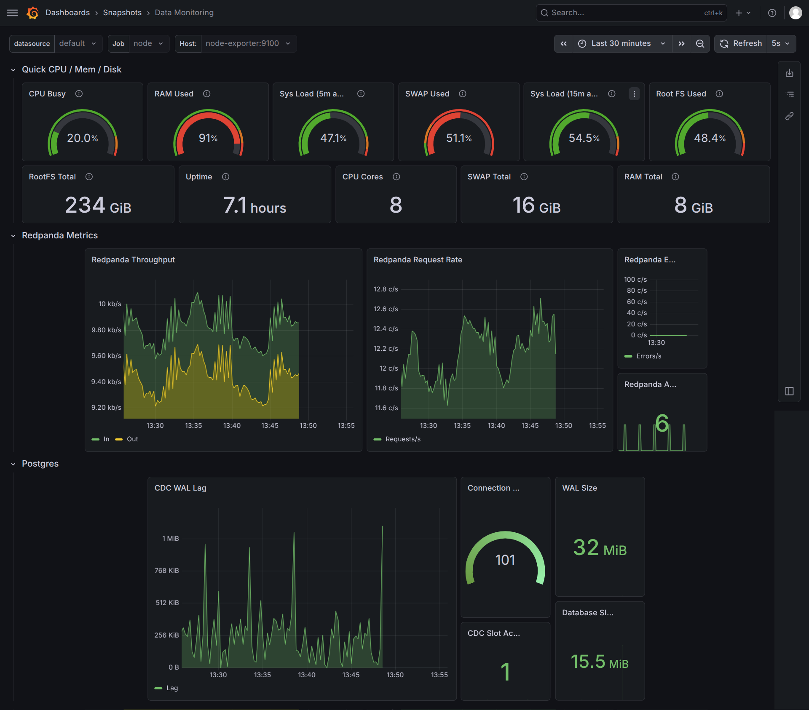
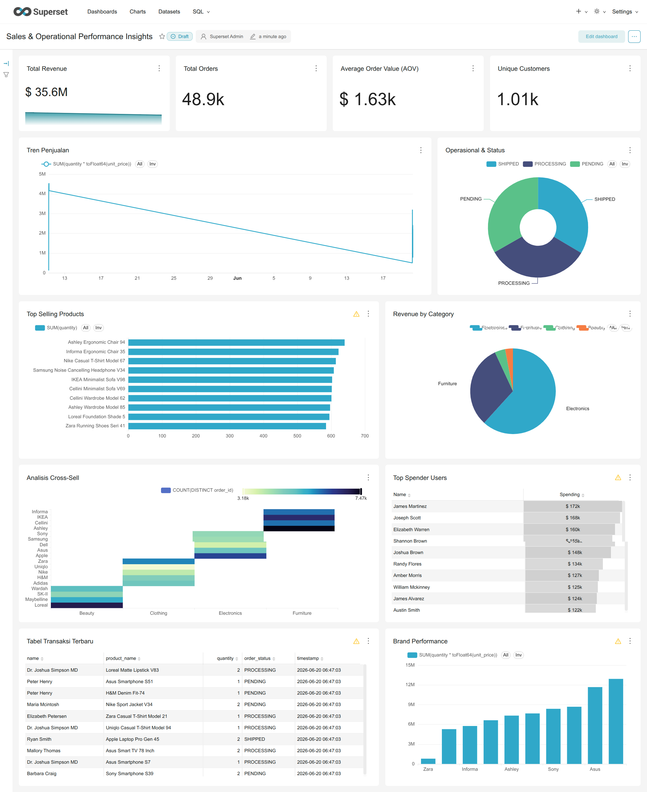

# Real-time CDC Pipeline (Postgres → ClickHouse)

<p align="center">
  
  
  
  
  
</p>

<p align="center">
  
  
  
  
</p>

Proyek ini adalah implementasi **real-time Change Data Capture (CDC)** dari simulasi database transaksional **E-Commerce** (PostgreSQL) ke ClickHouse. Setiap perubahan data (INSERT/UPDATE/DELETE) pada tabel `users`, `products`, `orders`, dan `order_items` langsung tertangkap, dikirim via Redpanda (Kafka), dan disimpan di ClickHouse sebagai **CDC Event Log** (history tracking) dengan medallion architecture (Bronze → Silver → Gold).

<br>


```mermaid
flowchart LR
    %% =========================
    %% Styles
    %% =========================
    classDef source fill:#2563EB,stroke:#1D4ED8,color:#FFFFFF,stroke-width:2px
    classDef cdc fill:#F97316,stroke:#EA580C,color:#FFFFFF,stroke-width:2px
    classDef broker fill:#7C3AED,stroke:#6D28D9,color:#FFFFFF,stroke-width:2px
    classDef processing fill:#0891B2,stroke:#0E7490,color:#FFFFFF,stroke-width:2px
    classDef storage fill:#EAB308,stroke:#CA8A04,color:#111827,stroke-width:2px
    classDef visualization fill:#16A34A,stroke:#15803D,color:#FFFFFF,stroke-width:2px
    classDef observability fill:#DC2626,stroke:#B91C1C,color:#FFFFFF,stroke-width:2px
    classDef operational fill:#475569,stroke:#334155,color:#FFFFFF,stroke-width:2px

    %% =========================
    %% Main data flow
    %% =========================
    subgraph sourceLayer["Source Layer"]
        api["Order Service<br/>FastAPI"]
        generator["Traffic Generator<br/>Faker"]
        postgres[("PostgreSQL 16<br/>Transactional Database")]

        api -->|"Create and update transactions"| postgres
        generator -->|"Generate synthetic traffic"| api
    end

    subgraph ingestionLayer["CDC Ingestion"]
        debezium["Debezium 3.6<br/>Kafka Connect"]
    end

    subgraph streamingLayer["Streaming Layer"]
        redpanda[("Redpanda<br/>Kafka-compatible Broker")]
        console["Redpanda Console"]
    end

    subgraph processingLayer["Stream Processing"]
        consumer["Go Consumer<br/>franz-go"]
    end

    subgraph analyticsLayer["Analytics Platform"]
        clickhouse[("ClickHouse<br/>CDC Event History")]
        medallion["Medallion Models<br/>Bronze → Silver → Gold"]
        superset["Apache Superset<br/>Analytics Dashboard"]
    end

    postgres -->|"WAL / logical replication"| debezium
    debezium -->|"Debezium JSON events"| redpanda
    redpanda -->|"Consumer group"| consumer
    consumer -->|"Validated batched inserts"| clickhouse
    clickhouse --> medallion
    medallion -->|"Analytical queries"| superset

    console -.->|"Inspect topics and messages"| redpanda

    %% =========================
    %% Observability
    %% =========================
    subgraph observabilityLayer["Observability"]
        nodeExporter["Node Exporter"]
        postgresExporter["Postgres Exporter"]
        prometheus["Prometheus"]
        grafana["Grafana"]

        nodeExporter --> prometheus
        postgresExporter --> prometheus
        prometheus --> grafana
    end

    postgres -.-> postgresExporter
    redpanda -.-> prometheus
    clickhouse -.-> prometheus

    class api,generator,postgres source
    class debezium cdc
    class redpanda broker
    class consumer processing
    class clickhouse,medallion storage
    class superset visualization
    class nodeExporter,postgresExporter,prometheus,grafana observability
    class console operational
```
<!--  -->
<br>

## Arsitektur

| Layer | Teknologi | Fungsi |
|-------|-----------|--------|
| **Source** | PostgreSQL (WAL) | Simulasi database transaksional E-Commerce (users, products, orders, order_items) |
| **Ingestion** | Debezium (Kafka Connect) | Kelola replication slot & logical decoding, kirim event standar Debezium ke Redpanda |
| **Message Broker** | Redpanda (Kafka) | Buffer pesan + Schema Registry (payload Debezium JSON) |
| **Warehouse** | ClickHouse | OLAP dengan CDC Event Logs + Materialized Views + Query-time Views (Silver/Gold) |
| **BI** | Apache Superset 6.0.0 | Dashboard analitik dari Gold layer (OBT) |
| **Monitoring** | Prometheus + Grafana | Monitoring WAL Lag, resource, dll |

## Tech Stack

| Teknologi | Kegunaan |
|-----------|----------|
| **Debezium (Kafka Connect)** | CDC engine — kelola replication slot, logical decoding, schema evolution |
| **PostgreSQL** | Source database transaksional E-Commerce (WAL logical replication) |
| **Redpanda** | Kafka-compatible message broker + Schema Registry (payload JSON) |
| **ClickHouse** | Data warehouse OLAP (Kafka Engine, Materialized Views, Query-time Views) |
| **Apache Superset** | BI dashboard dari Gold layer (One Big Table) |
| **Prometheus + Grafana** | Monitoring pipeline (WAL Lag, resource metrics) |
| **FastAPI (Python)** | Order service & traffic generator (Faker) |
| **Docker Compose** | Orchestrasi 13+ container |

## Dokumentasi

| Dokumen | Isi |
|---------|-----|
| [System Architecture](docs/system_architecture.md) | Diagram komponen & alur data |
| [Data Architecture](docs/data_architecture.md) | Medallion (Bronze → Silver → Gold) |
| [Data Dictionary](docs/data_dictionary_gold.md) | Skema & metrik tabel Gold (OBT) |
| [ERD Source](docs/erd_source.md) | Entity Relationship Diagram PostgreSQL |
| [ERD Warehouse](docs/erd_warehouse.md) | Entity Relationship Diagram ClickHouse (Bronze/Silver/Gold) |
| [ADR-001: Migrasi ke Debezium](docs/adr/ADR-001-migration-to-dbz.md) | Keputusan arsitektur migrasi CDC |
| [Legacy vs Debezium](docs/cdc_legacy_vs_debezium.md) | Perbandingan implementasi pglogrepl lama vs Debezium |

---

## Cara Jalankan

**Prerequisites:** Docker & Docker Compose, buat file `.env` (lihat `.env.example`)

```bash
# 1. Start semua service
make docker-up

# 2. Inisialisasi komponen (urutan penting)
make init-redpanda          # Buat topic cdc-events
make init-db                # Buat tabel E-Commerce di PostgreSQL (users, products, orders, order_items)
make init-dbz               # Generate & register connector Debezium (dari template + env)
make init-clickhouse        # Bronze Layer (CDC queue) + Silver/Gold Layer (views + OBT)
make init-superset          # Init admin & import dashboard

# 3. Seed data & testing
make seed-db                # Seed data dummy E-Commerce (users & products)
make generate-traffic       # Bot transaksi E-Commerce otomatis (real-time testing)

# 4. Monitoring
make logs-tg                # Lihat log traffic generator
```

## Akses Service

| Service | URL | Keterangan |
|---------|-----|------------|
| **Order API** | http://localhost:8000/docs | FastAPI Swagger |
| **Debezium Connect** | http://localhost:8083 | REST API Kafka Connect (status connector) |
| **Redpanda Console** | http://localhost:8888 | Lihat stream pesan Debezium (JSON + Schema Registry) |
| **Redpanda Schema Registry** | http://localhost:8081 | Registry skema payload Debezium |
| **Superset** | http://localhost:8088 | Dashboard BI (admin / lihat .env) |
| **Grafana** | http://localhost:3000 | Monitoring pipeline — WAL Lag, CPU, memory, disk (lihat .env) |
| **Prometheus** | http://localhost:9090 | Metrics pipeline |

### Grafana — Monitoring Dashboard

Monitoring pipeline secara real-time mencakup:
- **WAL Lag** — delay antara PostgreSQL dan CDC
- **Resource Usage** — CPU, memory, disk dari Node Exporter
- **Postgres Metrics** — koneksi, replikasi, long running transactions



### Superset — BI Dashboard

Dashboard analitik E-Commerce dari Gold layer (One Big Table), siap untuk eksplorasi data real-time.



## Validasi Real-time

Pipeline ini sudah divalidasi dengan cara:
1. **Hentikan connector Debezium** → event berhenti masuk, lag terlihat di Redpanda/Grafana
2. **Aktifkan lagi** → data catch up dan sinkron kembali
3. Data di ClickHouse selalu sinkron dengan PostgreSQL dalam hitungan detik

## Struktur Proyek

```
├── services/
│   ├── order-service/         # FastAPI + Data Generator (Faker)
│   ├── grafana/               # Grafana provisioning & dashboards
│   ├── prometheus/            # Prometheus config
│   └── postgres-source/       # Init SQL source
├── connectors/                # Konfigurasi connector Debezium (template + hasil generate)
├── scripts/
│   └── sql/                   # DDL PostgreSQL & ClickHouse (init_source, init_clickhouse)
├── deployments/docker/        # Docker Compose + konfigurasi
│   ├── docker-compose.yml
│   ├── Dockerfile.superset    # Superset 6.0.0 + ClickHouse driver
│   ├── clickhouse-users.xml
│   ├── init-superset.sh
│   └── dashboards/
├── docs/
│   ├── adr/                   # ADR-001: Migrasi ke Debezium
│   ├── cdc_legacy_vs_debezium.md
│   ├── screenshots/
│   └── ...
├── Makefile                   # Command utama
└── .env                       # Konfigurasi environment (jangan di-commit)
```

*Dibuat untuk keperluan belajar Data Engineering — Real-time Pipeline Journey.*
