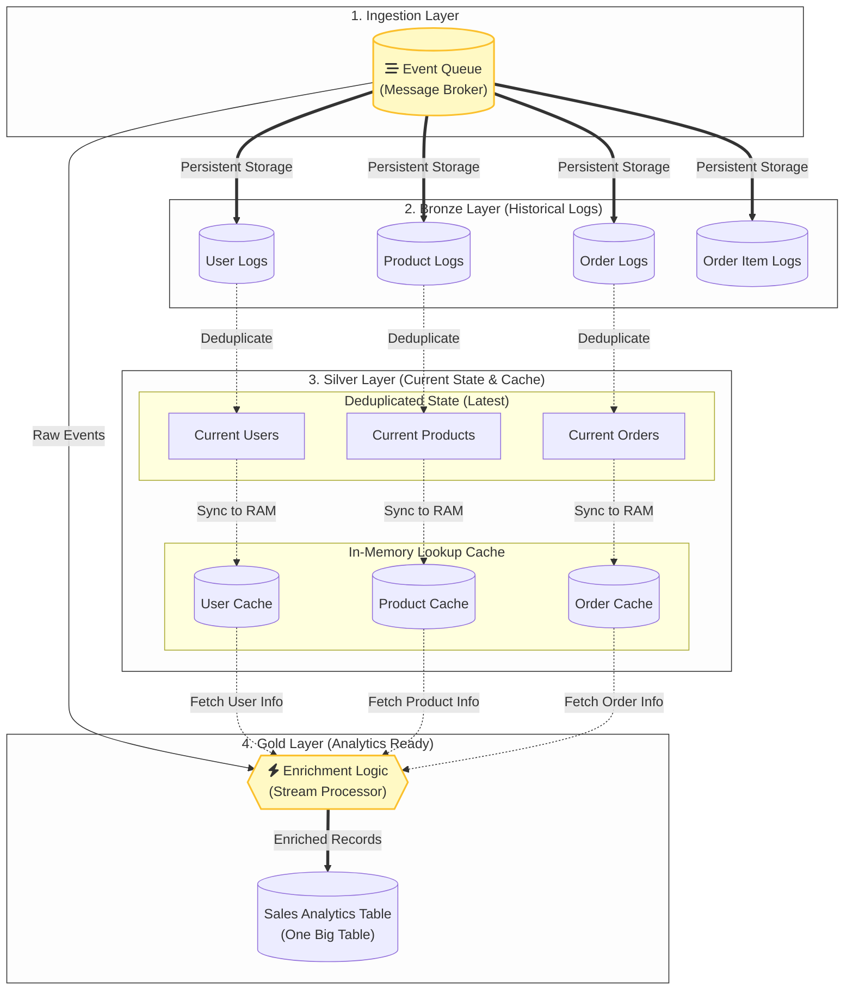

# Data Architecture Diagram (Medallion Architecture)

Diagram berikut menunjukkan bagaimana aliran data bergerak dalam arsitektur Medallion Anda, mulai dari ingest data melalui Kafka hingga ke lapisan Gold berupa *One Big Table* (OBT) di ClickHouse.

### Penjelasan Lapisan (Layers):

1. **Bronze Layer (Raw Historical Data)**: Menyimpan seluruh log kejadian (insert/update/delete) apa adanya. Berfungsi sebagai arsip atau sumber data historis menggunakan tabel tipe `MergeTree` biasa.
2. **Silver Layer (Current State & Cached)**:
   - Terdiri dari **View** (`vw_current_*`) yang menggunakan fungsi `argMax` untuk secara dinamis mencari data baris terakhir berdasarkan waktu (*timestamp*), sehingga menyingkirkan duplikasi log dari Bronze.
   - Terdiri dari **Dictionaries** (`dict_*`) yang menarik hasil View tersebut lalu menyimpannya di RAM (*Memory*). Ini krusial agar pencarian data (*lookup* / *join*) saat dipanggil jutaan kali dari kafka bisa berjalan dalam sepersekian milidetik.
3. **Gold Layer (One Big Table / OBT)**: Menggunakan fitur Materialized View (`analytics_sales_mv`) untuk membaca arus data *order_items* secara *real-time* langsung dari antrean Kafka (`cdc_queue`). Saat data lewat, ia mengambil fungsi *dictGet* untuk meminta info pelengkap dari Silver Dictionaries (RAM) kemudian menggabungkannya ke tabel lebar `analytics_sales_obt` yang siap dihubungkan langsung ke *dashboard* Superset.
