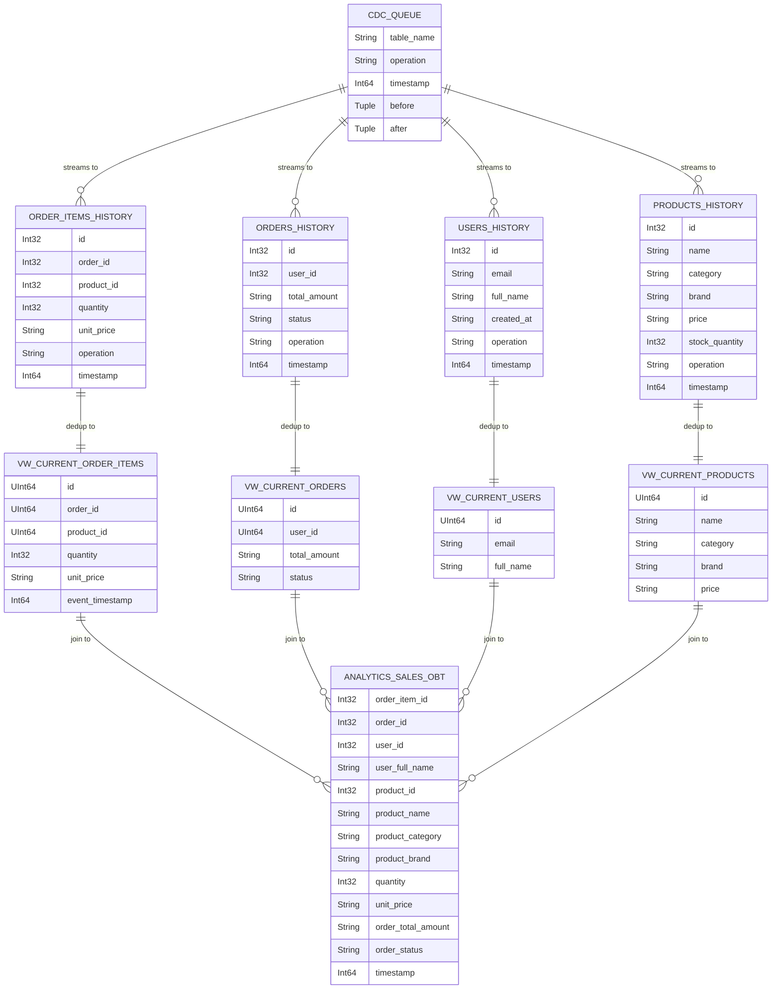

```mermaid
erDiagram
    CDC_QUEUE ||--o{ USERS_HISTORY : "streams to"
    CDC_QUEUE ||--o{ PRODUCTS_HISTORY : "streams to"
    CDC_QUEUE ||--o{ ORDERS_HISTORY : "streams to"
    CDC_QUEUE ||--o{ ORDER_ITEMS_HISTORY : "streams to"

    USERS_HISTORY ||--|| VW_CURRENT_USERS : "dedup to"
    PRODUCTS_HISTORY ||--|| VW_CURRENT_PRODUCTS : "dedup to"
    ORDERS_HISTORY ||--|| VW_CURRENT_ORDERS : "dedup to"
    ORDER_ITEMS_HISTORY ||--|| VW_CURRENT_ORDER_ITEMS : "dedup to"

    VW_CURRENT_ORDER_ITEMS ||--o{ ANALYTICS_SALES_OBT : "join to"
    VW_CURRENT_ORDERS ||--o{ ANALYTICS_SALES_OBT : "join to"
    VW_CURRENT_USERS ||--o{ ANALYTICS_SALES_OBT : "join to"
    VW_CURRENT_PRODUCTS ||--o{ ANALYTICS_SALES_OBT : "join to"

    CDC_QUEUE {
        String table_name
        String operation
        Int64 timestamp
        Tuple before
        Tuple after
    }

    USERS_HISTORY {
        Int32 id
        String email
        String full_name
        String created_at
        String operation
        Int64 timestamp
    }

    PRODUCTS_HISTORY {
        Int32 id
        String name
        String category
        String brand
        String price
        Int32 stock_quantity
        String operation
        Int64 timestamp
    }

    ORDERS_HISTORY {
        Int32 id
        Int32 user_id
        String total_amount
        String status
        String operation
        Int64 timestamp
    }

    ORDER_ITEMS_HISTORY {
        Int32 id
        Int32 order_id
        Int32 product_id
        Int32 quantity
        String unit_price
        String operation
        Int64 timestamp
    }

    VW_CURRENT_USERS {
        UInt64 id
        String email
        String full_name
    }

    VW_CURRENT_PRODUCTS {
        UInt64 id
        String name
        String category
        String brand
        String price
    }

    VW_CURRENT_ORDERS {
        UInt64 id
        UInt64 user_id
        String total_amount
        String status
    }

    VW_CURRENT_ORDER_ITEMS {
        UInt64 id
        UInt64 order_id
        UInt64 product_id
        Int32 quantity
        String unit_price
        Int64 event_timestamp
    }

    ANALYTICS_SALES_OBT {
        Int32 order_item_id
        Int32 order_id
        Int32 user_id
        String user_full_name
        Int32 product_id
        String product_name
        String product_category
        String product_brand
        Int32 quantity
        String unit_price
        String order_total_amount
        String order_status
        Int64 timestamp
    }
```
