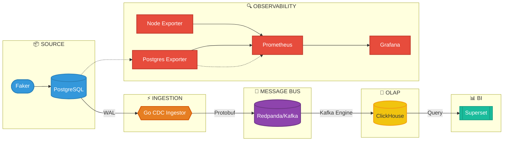

# System Architecture Diagram

Diagram ini merepresentasikan arsitektur sistem level makro (infrastruktur perangkat lunak). Ini berbeda dengan arsitektur data; diagram ini menunjukkan aplikasi, *database*, dan *tools* apa saja yang digunakan serta bagaimana mereka terhubung dalam suatu *pipeline*.

### Penjelasan Komponen Sistem:

1. **Source** — **Faker** (traffic generator) menyimulasikan transaksi E-Commerce ke **PostgreSQL**. PostgreSQL diaktifkan WAL *logical replication* untuk CDC.
2. **Ingestion** — **Go CDC Ingestor** membaca WAL PostgreSQL secara *real-time*, menserialisasi event ke **Protobuf**, lalu mengirimkannya ke Redpanda.
3. **Message Bus** — **Redpanda** (Kafka-compatible) menerima event Protobuf dengan 3 partisi untuk *row-level ordering*.
4. **OLAP** — **ClickHouse** menggunakan *Kafka Engine* langsung consume dari Redpanda, lalu memproses data ke layer Medallion (Bronze → Silver → Gold).
5. **BI** — **Apache Superset** membaca tabel Gold (OBT) untuk dashboard analitik E-Commerce.
6. **Observability** — **Node Exporter** & **Postgres Exporter** mengirim metrik ke **Prometheus**, lalu divisualisasikan di **Grafana** — termasuk WAL Lag, CPU, memory, disk.
