# System Architecture Diagram

Diagram ini merepresentasikan arsitektur sistem level makro (infrastruktur perangkat lunak). Ini berbeda dengan arsitektur data; diagram ini menunjukkan aplikasi, *database*, dan *tools* apa saja yang digunakan serta bagaimana mereka terhubung dalam suatu *pipeline*.

```mermaid
flowchart LR
    %% Subgraph Styles
    classDef pg fill:#336791,stroke:#fff,stroke-width:2px,color:#fff;
    classDef go fill:#00ADD8,stroke:#fff,stroke-width:2px,color:#fff;
    classDef kafka fill:#1e1e1e,stroke:#fff,stroke-width:2px,color:#fff;
    classDef ch fill:#FFCC01,stroke:#333,stroke-width:2px,color:#333;
    classDef bi fill:#00A699,stroke:#fff,stroke-width:2px,color:#fff;
    
    subgraph SOURCE ["Source System"]
        direction TB
        generator(["Robot Order Generator"])
        pg_db[("PostgreSQL\n(Transactional DB)")]
    end

    subgraph STREAMING ["Real-time CDC Streaming"]
        direction TB
        go_cdc{{"Go CDC Ingestor\n(Protobuf Serialize)"}}
        redpanda[("Redpanda / Kafka\n(Message Broker)")]
    end

    subgraph ANALYTICS ["Data Warehouse & BI"]
        direction TB
        ch_dw[("ClickHouse\n(OLAP Medallion)")]
        superset[["Apache Superset\n(Dashboard)"]]
    end

    %% Flow logic
    generator -- "Simulate E-Commerce\n(Insert/Update)" --> pg_db
    pg_db -- "Change Data Capture\n(Listen to WAL)" --> go_cdc
    go_cdc -- "Publish Events\n(Protobuf format)" --> redpanda
    redpanda -- "Consume Stream\n(Kafka Engine)" --> ch_dw
    ch_dw -- "Query Analytics\n(Read OBT)" --> superset

    %% Styling apply
    class pg_db pg;
    class go_cdc go;
    class redpanda kafka;
    class ch_dw ch;
    class superset bi;
```

### Penjelasan Komponen Sistem:

1. **Source System (PostgreSQL & Generator)**: Sebuah robot/skrip berjalan menyimulasikan transaksi E-Commerce (menambah user, membuat order, dsb) secara langsung ke *database* operasional PostgreSQL.
2. **Go CDC Ingestor**: Layanan *backend* khusus buatan sendiri (*custom*) menggunakan Golang yang bertugas menangkap setiap perubahan (CDC) di PostgreSQL. Data tersebut kemudian dibungkus dan dienkode secara efisien menggunakan Protobuf (`event.proto`).
3. **Redpanda / Kafka**: Berfungsi sebagai jalur antrean (*message broker*) berkecepatan tinggi yang menerima aliran *event* berformat Protobuf dari layanan Golang.
4. **ClickHouse (Data Warehouse)**: Bertindak sebagai konsumen (*consumer*) langsung dari Kafka menggunakan fitur *Kafka Engine*, lalu memproses data kotor melalui lapisan *Medallion* (Bronze -> Silver -> Gold).
5. **Apache Superset (BI & Visualization)**: Platform antarmuka untuk membaca tabel Gold di ClickHouse guna menampilkan *dashboard* analitik berkecepatan *sub-second* kepada *end-user*.
